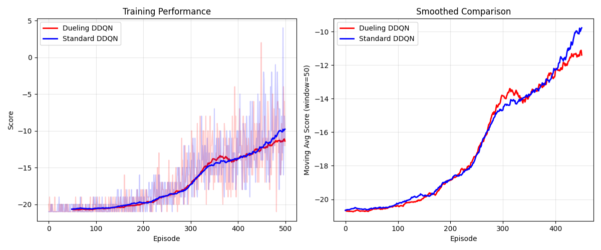

# Dueling DQN vs Standard DDQN (PyTorch)

Implementation of [Wang et al. 2016](https://arxiv.org/abs/1511.06581) 
with head-to-head comparison on Atari Pong.

## Architecture
- **Dueling DQN**: Shared conv → V(s) stream + A(s,a) stream → Q = V + (A - mean(A))
- **Standard DQN**: Single-stream baseline (same capacity)
- **Algorithm**: Double DQN with gradient clipping

## Results (Pong-v5, 500 episodes)

| Model | Last-50 Mean Score | Best Score |
|-------|-------------------|------------|
| Standard DDQN | ~-10.5 | -8.6 |
| Dueling DDQN | ~-11.5 | -10.1 |

Note: Pong has only 6 actions; dueling advantages are more pronounced 
on high-action games per the paper.

### Training Curves


## Run
```bash
pip install -r requirements.txt
python main.py