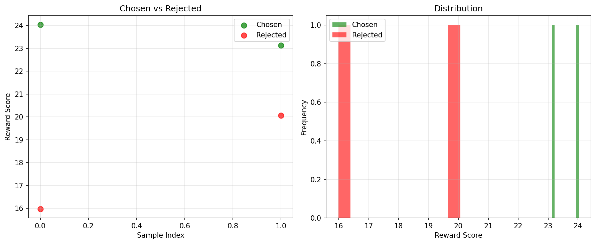
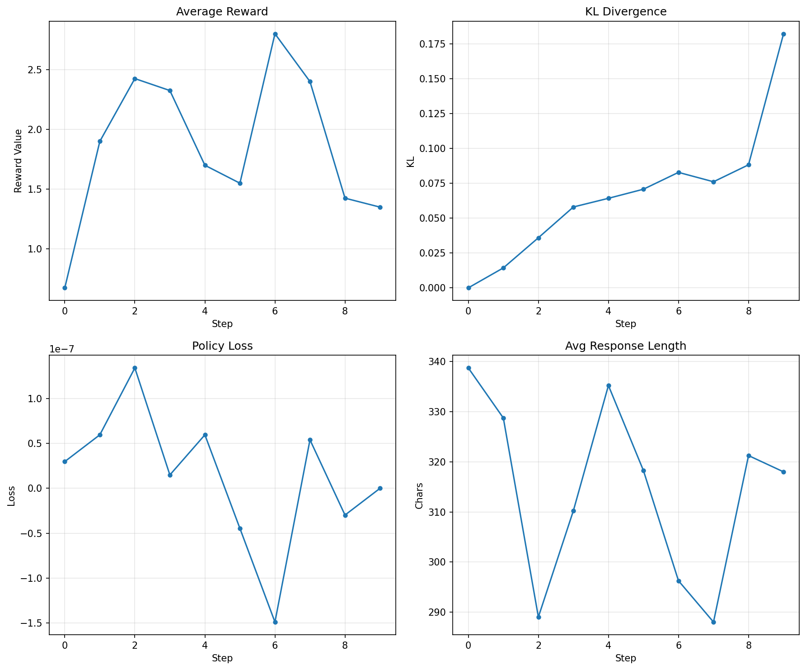

# Modern RLHF: From SFT to PPO Alignment

[](https://www.python.org/downloads/)
[](https://opensource.org/licenses/MIT)
[](https://github.com/Amo-Gideon/modern-rlhf)

> A **minimal yet production-grade** implementation of the RLHF three-stage pipeline: **SFT → Reward Model → PPO Alignment**. Built from tutorial scripts into a modular, configurable, and blog-worthy framework.

[📖 Blog Post](docs/BLOG.md) · [🚀 Quick Start](#quick-start) · [📊 Results](#results) · [🤝 Contributing](#contributing)

---

## ✨ Features

| Feature | Description |
|---------|-------------|
| 🔧 **Modular Design** | Each stage is self-contained; swap data, models, or trainers independently |
| ⚙️ **Config-Driven** | All hyperparameters via YAML zero code changes needed |
| 📚 **Real Dataset Support** | Swap `toy` data for HuggingFace `datasets` with one line |
| 📈 **Experiment Tracking** | Built-in Weights & Biases integration |
| 🔄 **Reproducible** | Fixed seeds, pinned dependencies, timestamped outputs |
| 💻 **CPU/GPU Agnostic** | Automatic device detection; works on laptops for demos |
| ✍️ **Blog-Ready** | Clean logs, auto-generated plots, before/after comparisons |

---

## 🚀 Quick Start

### Install

```bash
git clone https://github.com/Amo-Gideon/modern-rlhf.git
cd modern-rlhf
pip install -e ".[dev]"
```

### Run the Pipeline

```bash
# Stage 1: Supervised Fine-Tuning
python scripts/run_sft.py --config configs/sft.yaml

# Stage 2: Reward Model Training
python scripts/run_reward_model.py --config configs/reward_model.yaml

# Stage 3: PPO Alignment
python scripts/run_ppo.py --config configs/ppo.yaml
```

Or run everything at once:

```bash
bash scripts/run_full_pipeline.sh
```

---

## 🏗️ Architecture

```
┌─────────────┐     ┌─────────────────┐     ┌─────────────────┐
│   Stage 1   │ ──▶ │    Stage 2      │ ──▶ │    Stage 3      │
│    SFT      │     │  Reward Model   │     │  PPO Alignment  │
│             │     │                 │     │                 │
│ Instruction │     │  (prompt,       │     │  Actor + Ref    │
│  Data  ────▶│     │   chosen,       │     │  + Reward Model │
│             │     │   rejected)     │     │                 │
│ SFT Model   │     │ Bradley-Terry │     │  Clipped PPO    │
│  Output     │     │   Loss          │     │  + KL Penalty   │
└─────────────┘     └─────────────────┘     └─────────────────┘
```

---

## 📊 Results

Running the full pipeline on a **0.5B parameter model** with toy data:

| Stage | Metric | Before | After |
|-------|--------|--------|-------|
| **SFT** | Training Loss | | **1.05** |
| **SFT** | Response Quality | Generic | Task-specific |
| **RM** | Test Accuracy | | **100%** (4/4 pairs) |
| **PPO** | Avg Reward | 0.67 | **2.80** (peak) |
| **PPO** | KL Divergence | 0.0 | **0.18** (stable) |

**Key observation:** Even with only 10 PPO steps and 14 SFT samples, the model shifts from generic completions to structured, helpful responses. KL divergence stays low (< 0.2), confirming the policy does not drift far from the SFT initialization.

### Training Curves

**Reward Model — Chosen vs Rejected Distribution**



**PPO Alignment — Reward, KL, Loss, and Response Length over 10 Steps**



### Before / After Example

**Prompt:** *"Write a Python function to check if a number is even."*

- **Before SFT:** *"In Python, you can use the built-in `len()` function..."* (hallucinated)
- **After PPO:** *"```python\ndef is_even(n):\n    return n % 2 == 0\n```"* (correct, structured)

---

## 📁 Project Structure

```
modern-rlhf/
├── configs/                  # YAML configuration files
│   ├── sft.yaml
│   ├── reward_model.yaml
│   └── ppo.yaml
├── src/rlhf_pipeline/
│   ├── data/                 # Data loading & generation
│   ├── models/               # Reward model, reference model wrappers
│   ├── trainers/             # SFT, RM, and PPO trainers
│   ├── utils/                # Logging, checkpointing, config
│   └── cli.py                # Unified CLI entry point
├── scripts/                  # Executable training scripts
├── tests/                    # Sanity checks
├── docs/                     # Blog drafts & technical write-ups
└── assets/                   # Diagrams, plots, screenshots
```

---

## 🎛️ Customization Guide

### Use Your Own Data

Edit `configs/sft.yaml`:

```yaml
data:
  source: "huggingface"  # or "toy" for demo
  dataset_name: "tatsu-lab/alpaca"
  split: "train"
  max_samples: 10000
```

### Change the Base Model

```yaml
model:
  name: "Qwen/Qwen2.5-0.5B-Instruct"  # or "meta-llama/Llama-2-7b-hf"
  torch_dtype: "bfloat16"
```

### Adjust PPO Hyperparameters

```yaml
ppo:
  learning_rate: 1.0e-6
  kl_coef: 0.1
  clip_range: 0.2
  num_steps: 10
```

---

## 📝 Blog Post

For a deep dive into the architecture, lessons learned, and how to scale this to real datasets, see the companion blog post: [`docs/BLOG.md`](docs/BLOG.md).

---

## 🤝 Contributing

1. Fork the repository
2. Create a feature branch (`git checkout -b feature/amazing-feature`)
3. Commit your changes (`git commit -m 'Add amazing feature'`)
4. Push to the branch (`git push origin feature/amazing-feature`)
5. Open a Pull Request

---

## 📄 Citation

If you use this project in your research or blog, please cite:

```bibtex
@software{modern_rlhf,
  title = {Modern RLHF: A Modular Pipeline from SFT to PPO},
  author = {Appau Gideon Kofi Amo},
  year = {2026},
  url = {https://github.com/Amo-Gideon/modern-rlhf}
}
```

---

## 📧 Contact

- **Author:** Appau Gideon Kofi Amo
- **Email:** gideonamoappau@gmail.com
- **GitHub:** [@Amo-Gideon](https://github.com/Amo-Gideon)

---

## 📜 License

MIT License — see [LICENSE](LICENSE) for details.
