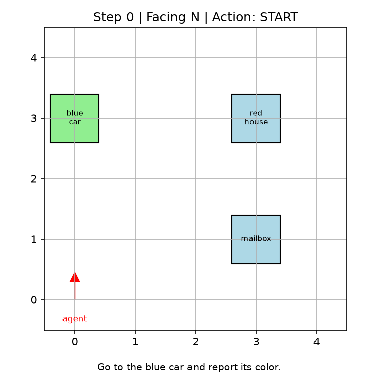
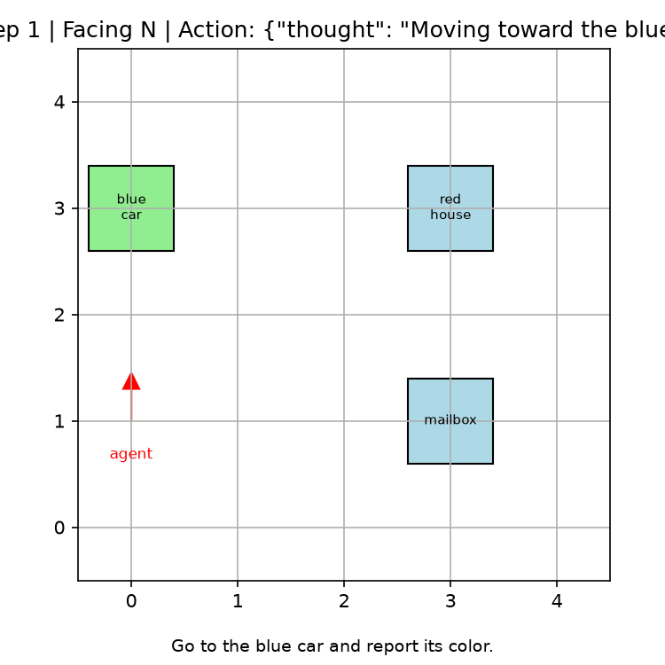
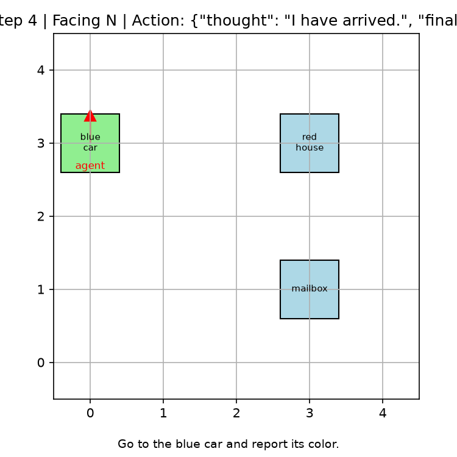

# Language-Guided Navigation Agent

A small end-to-end project where a 0.5B parameter language model learns to follow natural-language navigation instructions on a grid and answer a question about the object it reaches.

The agent receives instructions like *"Go to the red house and report its color"*, observes its surroundings as text, and emits structured JSON actions (`move_forward`, `turn_left`, `turn_right`, `look`) until it decides to answer.

## What I built

- **`src/env.py`** — a deterministic grid-world environment with landmarks and verifiable rewards.
- **`src/dataset.py`** — shortest-path expert trajectories generated with BFS for supervised warm-start.
- **`scripts/sft.py`** — LoRA fine-tuning of `Qwen2.5-0.5B-Instruct` on expert demos, using the model’s chat template.
- **`scripts/train_rl.py`** — REINFORCE + KL-penalty fine-tuning against a frozen reference model.
- **`scripts/eval.py`** / **`scripts/demo.py`** — greedy evaluation and interactive demo.
- **`scripts/visualize.py`** — frame-by-frame grid visualization of an episode.

## Results

| Stage | Success Rate | Avg Reward |
|-------|--------------|------------|
| SFT warm-start | 9/20 (45%) | 0.697 |
| After RL fine-tuning | 11/20 (55%) | 0.738 |

The RL stage gave a clear improvement over the supervised baseline. The biggest bottleneck now is the 15-step episode limit and the sparse reward signal — the agent sometimes wanders before locating the target.

## Episode visualization

A successful episode (`visualize.py` with `--find_success`), showing the agent navigating to the target (green) and answering its color:

| Start | Move | Move | Move | Answer |
|-------|------|------|------|--------|
|  |  |  |  |  |

Regenerate with:

```bash
python scripts/visualize.py --checkpoint outputs/rl --output_dir assets/episode_viz --find_success
```

## Quick start in PAI-DSW / Online VS Code

The PAI-DSW image I used is `ubuntu22.04-py312-torch2.3.1-1.39.0`, which already has PyTorch.

Install dependencies:

```bash
git clone https://github.com/Amo-Gideon/rl-portfolio.git
cd rl-portfolio/language-guided-navigation
pip install transformers peft accelerate pyyaml tqdm matplotlib
```

### Download the base model

PAI-DSW cannot reach HuggingFace reliably, so download the model first. Either use the ModelScope downloader:

```bash
python scripts/download_model.py --source modelscope
```

Or, if that fails, download `Qwen2.5-0.5B-Instruct` locally, zip it, upload it to `rl-portfolio/language-guided-navigation/models/`, and unzip:

```bash
cd models
python -m zipfile -e Qwen2.5-0.5B-Instruct.zip .
```

Set the resulting path as `model.name` in `configs/sft.yaml` and `configs/rl.yaml`. The default is `./models/Qwen2.5-0.5B-Instruct`.

### Train

Supervised warm-start:

```bash
python scripts/sft.py --config configs/sft.yaml
```

RL fine-tuning:

```bash
python scripts/train_rl.py --config configs/rl.yaml
```

### Evaluate / demo / visualize

```bash
python scripts/eval.py --checkpoint outputs/sft --num_tasks 20
python scripts/eval.py --checkpoint outputs/rl --num_tasks 20
python scripts/demo.py --checkpoint outputs/rl
python scripts/visualize.py --checkpoint outputs/rl --output_dir assets/episode_viz
```

## Local sanity checks

No GPU or model download needed for the environment tests:

```bash
python tests/test_env.py
python tests/test_dataset.py
```

## Project structure

```
language-guided-navigation/
├── configs/          # YAML configs for SFT and RL
├── scripts/          # training, eval, demo, visualization
├── src/              # env, dataset, model utils, trainer
├── tests/            # unit tests
└── assets/           # generated episode visualizations
```

## What I learned / next steps

- **Chat template matters.** The first SFT attempt failed because I fed plain text to an instruct model; switching to the Qwen chat format immediately fixed the output structure.
- **Sparse rewards are hard.** A 55% success rate means the agent still loses the target roughly half the time. Adding distance-based reward shaping or a larger instruction-following model would likely push this higher.
- **Future extensions:** replace the text grid with a small rendered 3D scene, add a vision encoder, or swap REINFORCE for GRPO/VIMPO.
