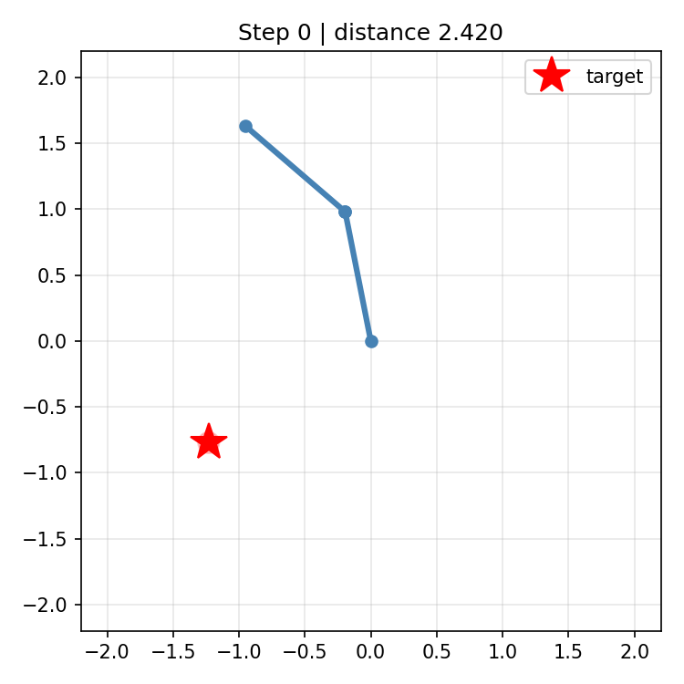
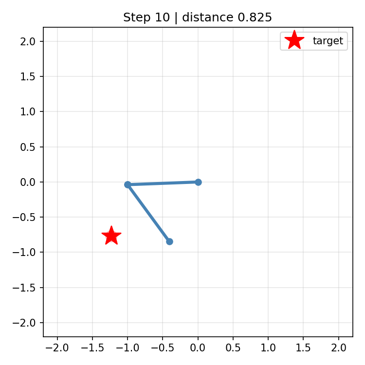
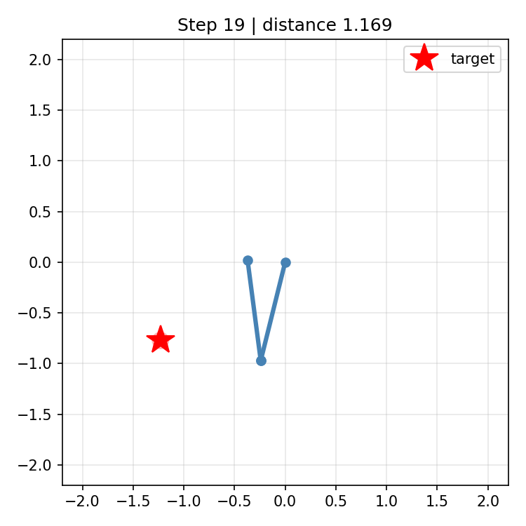
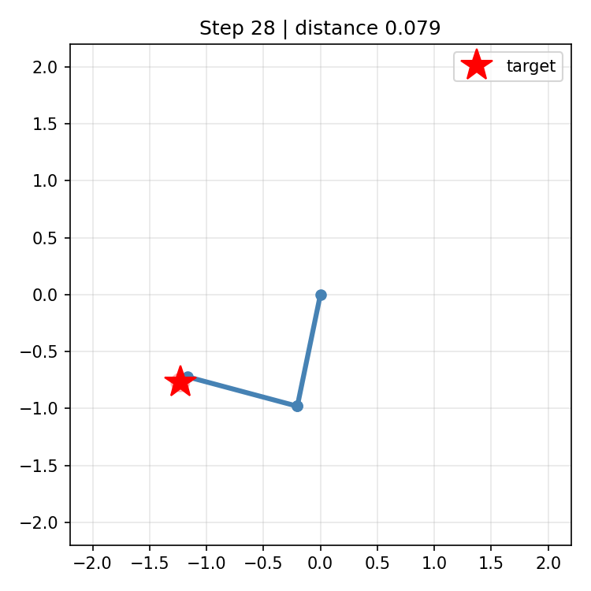

# 2-Link Robot Arm Reaching with PPO

Continuous-control RL on a classic robotics task: a planar 2-link robot arm learns to reach random target points using **PPO**.

The arm is a custom **Gymnasium** environment (pure forward kinematics, no simulator dependency), and I train it two ways:

1. **Stable-Baselines3 PPO** (`scripts/train_sb3.py`) — the standard, battle-tested stack.
2. **A from-scratch PPO** (`src/ppo.py` + `scripts/train.py`) — Gaussian actor-critic, GAE, clipped surrogate, written with plain PyTorch to show the mechanics.

Everything runs on CPU with `torch`, `gymnasium`, and `matplotlib`.

## Setup

```bash
pip install -r requirements.txt
python tests/test_env.py   # sanity checks, no training
```

## Train (SB3, recommended)

```bash
python scripts/train_sb3.py --timesteps 250000 --device cpu
```

A callback tracks rolling success rate and saves the best checkpoint to `outputs/sb3_arm.zip`.

## Or train the from-scratch PPO

```bash
python scripts/train.py --episodes 1500 --batch_episodes 20 --device cpu
```

## Evaluate / visualize

Both trainers share the same env, so evaluation and visualization work for either checkpoint:

```bash
# SB3 checkpoint
python scripts/eval.py --checkpoint outputs/sb3_arm.zip --sb3 --episodes 50
python scripts/visualize.py --checkpoint outputs/sb3_arm.zip --sb3 --output_dir assets/viz

# from-scratch checkpoint
python scripts/eval.py --checkpoint outputs/ppo_arm.pt --episodes 50
python scripts/visualize.py --checkpoint outputs/ppo_arm.pt --output_dir assets/viz
```

## Results

PPO (SB3) trained for 250k timesteps on CPU, evaluated on 100 held-out episodes:

| Metric | Value |
|--------|-------|
| Success rate | **70.0%** |
| Final distance | 0.103 +- 0.092 |
| Avg episode length | 44.4 (early stop on success) |

A successful reaching episode (start -> success in 28 steps):

| Start | Mid | Mid | Success |
|-------|-----|-----|---------|
|  |  |  |  |

## Environment details

- **State** (6-dim): `[cos j1, sin j1, cos j2, sin j2, target_x, target_y]` — joint angles encoded as sin/cos so the policy sees a continuous representation.
- **Action** (2-dim Box in [-1, 1]): joint increments, internally scaled by `max_speed`.
- **Reward**: `0.1 * (-distance) - action_penalty + 1.0` on success (within `success_radius`).

## What I learned

- **Reward scaling matters.** Raw distances (1–2 units) made value-loss gradients dominate and the policy plateaued. Scaling the distance term to ~0.1 stabilized training immediately.
- **Standard stacks earn their keep.** The from-scratch PPO works but is far more sample-hungry; SB3's tuned defaults (advantage normalization, value clipping, minibatch epochs) reach good success rates with far less fuss.
- **sin/cos angle encoding** beats raw radians for policy input — no discontinuity at ±π.
